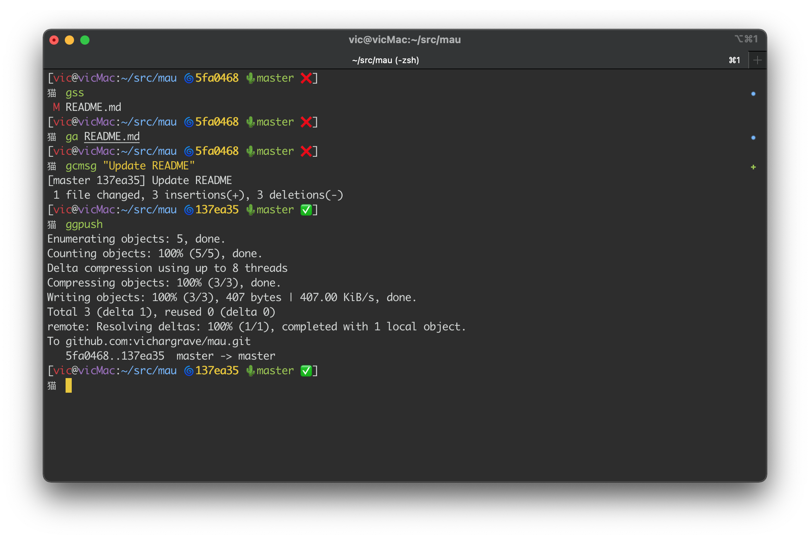

# mau 

I use [Oh My Zsh](http://ohmyz.sh/) for my command line in [iTerm](https://www.iterm2.com/) on the Mac and other *linx distros.  **mau** is an Oh My Zsh theme that I hacked together combining the best of the _kphoen_ and _smt_ themes.  **mau** is the English 
literation of the Chinese word for _cat_.  

This theme puts all the status information on one line then and has a clean command line with cat prmpt emoji.

## Installing **mau**

1. Clone the **mau.zsh-theme** project.
2. Copy the **mau.zsh-theme** file to your *$HOME/.oh-my-zsh/themes* directory.
3. Open your *$HOME/.zshrc* file.
4. Set the **ZSH_THEME** variable to **mau**, then save the file.
5. Run `source $HOME/.zshrc`
6. Revel in the fun that is Oh My Zsh with **mau**

## Credits

Thanks to  [Tao Wang](https://github.com/vichargrave/mau/issues?q=is%3Apr+author%3Atwang2218) for the colorful tidbits. 
